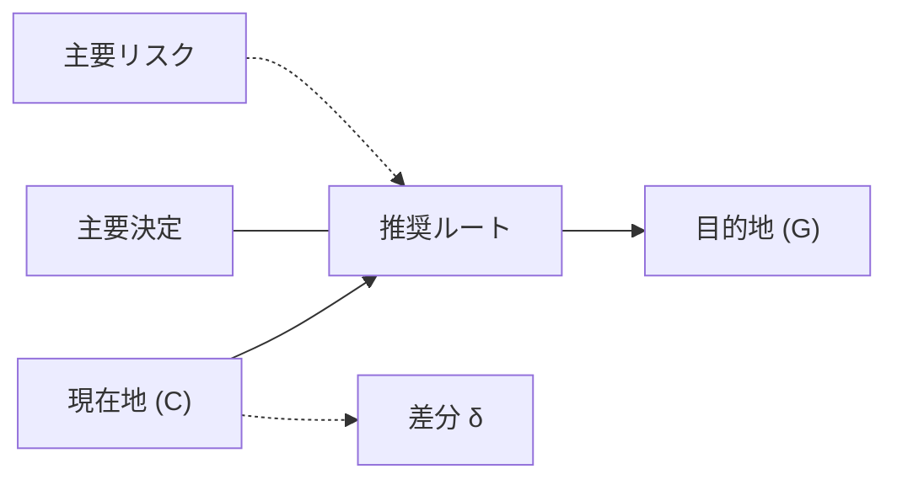

```mermaid
flowchart LR
  C["現在地 (C)"] --> route["推奨ルート"]
  route --> G["目的地 (G)"]
  C -.-> delta["差分 δ"]
  decisions["主要決定"] --- route
  risks["主要リスク"] -.-> route
%% C: - 要約PipelineはGREEN - READMEの10分再現も完了
%% G: - READMEの10分再現も完了
%% δ: - DigestのMVPを実装する
```
