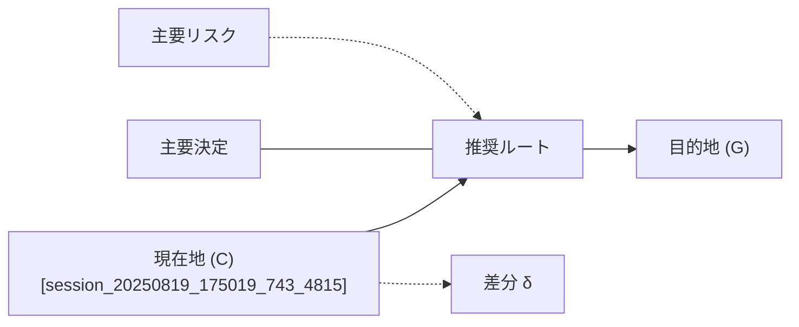

```mermaid
flowchart LR
  C["現在地 (C)\n[session_20250819_175019_743_4815]"] --> route["推奨ルート"]
  route --> G["目的地 (G)"] 
  C -.-> delta["差分 δ"]
  decisions["主要決定"] --- route
  risks["主要リスク"] -.-> route
%% C: 
%% G: 
%% δ: 
```
