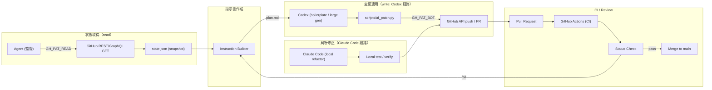

```mermaid
flowchart LR
    %% ===== Read (状態取得) =====
    subgraph read_flow [状態取得（read）]
        AGENT["Agent (監督)"]
        API_GET["GitHub REST/GraphQL GET"]
        SNAP["state.json (snapshot)"]
        AGENT -->|GH_PAT_READ| API_GET
        API_GET --> SNAP
    end

    %% ===== 指示書作成 =====
    subgraph plan_flow [指示書作成]
        BUILDER["Instruction Builder"]
        SNAP --> BUILDER
    end

    %% ===== Write (変更適用: Codex 経路) =====
    subgraph write_flow [変更適用（write: Codex 経路）]
        CODEX["Codex (boilerplate / large gen)"]
        PATCH["scripts/ai_patch.py"]
        API_PUSH["GitHub API push / PR"]
        BUILDER -->|plan.md| CODEX
        CODEX --> PATCH
        PATCH -->|GH_PAT_BOT| API_PUSH
    end

    %% ===== Local small fix (Claude Code 経路) =====
    subgraph local_flow [局所修正（Claude Code 経路）]
        CLAUDE["Claude Code (local refactor)"]
        DEV["Local test / verify"]
        CLAUDE --> DEV
        DEV --> API_PUSH
    end

    %% ===== CI / Review =====
    subgraph ci_flow [CI / Review]
        PR["Pull Request"]
        GA["GitHub Actions (CI)"]
        STATUS["Status Check"]
        MERGE["Merge to main"]
        API_PUSH --> PR
        PR --> GA
        GA --> STATUS
        STATUS -->|pass| MERGE
        STATUS -->|fail| BUILDER
    end
```