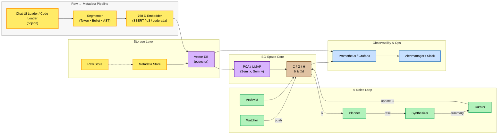

```mermaid
%% ─────────────────────────────────────────────
%%  Hyper-Swarm / VPM — Roadmap × Architecture Map
%%  ─ 色分け Legend ─
%%    🟡 Step-A（いま実装中）
%%    🟢 Phase 0（Step-B：5 Roles 試走）
%%    🔵 Phase 1（PoC＋KPI 可視化）
%%    🟣 Phase 2（小規模 Swarm & Vector DB）
%%    🟤 Phase 3（EG-Space 完成 & セキュア化）
%% ─────────────────────────────────────────────

flowchart LR
    %% ---------- Ingestion ----------
    subgraph Ingestion ["Raw → Metadata Pipeline"]
        style Ingestion fill:#F7F7F7,stroke:#999,stroke-width:1px
        LOADER["Chat-UI Loader / Code Loader<br/>(ndjson)"]
        SEG["Segmenter<br/>(Token・Bullet・AST)"]
        EMBED["768 D Embedder<br/>(SBERT / o3 / code-ada)"]
        LOADER --> SEG --> EMBED
    end

    %% ---------- Storage ----------
    subgraph Store ["Storage Layer"]
        RAW["Raw Store"]
        META["Metadata Store"]
        VEC["Vector DB<br/>(pgvector)"]
        RAW -.-> META --> VEC
        EMBED --> VEC
    end

    %% ---------- EG-Space ----------
    subgraph EGSpace ["EG-Space Core"]
        PCA["PCA / UMAP<br/>(Sem_x, Sem_y)"]
        CGH["C / G / H<br/>δ & ⃗d"]
        VEC --> PCA --> CGH
    end

    %% ---------- 5 Roles ----------
    subgraph Agents ["5 Roles Loop"]
        WATCHER["Watcher"]
        CURATOR["Curator"]
        PLANNER["Planner"]
        SYNTH["Synthesizer"]
        ARCH["Archivist"]
        WATCHER -->|push| CGH
        CURATOR -->|update G| CGH
        CGH -->|δ| PLANNER
        PLANNER -->|task| SYNTH
        SYNTH -->|summary| CURATOR
        ARCH --> CGH
    end

    %% ---------- Observability ----------
    subgraph Ops ["Observability & Ops"]
        PROM["Prometheus / Grafana"]
        ALERT["Alertmanager / Slack"]
        CGH --> PROM
        VEC --> PROM
        PROM --> ALERT
    end

    %% ---------- Coloring by Phase ----------
    classDef StepA fill:#FFEB67,stroke:#FF9900,stroke-width:2px,color:#000;
    classDef Phase0 fill:#B2F2BB,stroke:#009B4D,stroke-width:2px,color:#000;
    classDef Phase1 fill:#C7E0FF,stroke:#005BBB,stroke-width:2px,color:#000;
    classDef Phase2 fill:#D8B4FE,stroke:#6B21A8,stroke-width:2px,color:#000;
    classDef Phase3 fill:#E0C2A2,stroke:#8B5E34,stroke-width:2px,color:#000;

    class LOADER,SEG,EMBED,RAW,META StepA;
    class WATCHER,CURATOR,PLANNER,SYNTH,ARCH Phase0;
    class PROM,ALERT Phase1;
    class VEC,PCA Phase2;
    class CGH Phase3;
```
