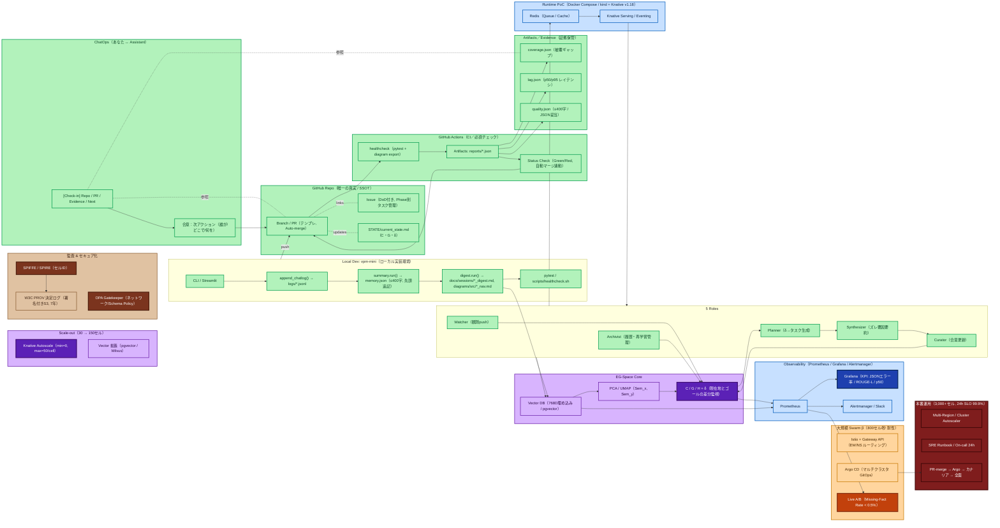

```mermaid
%% ─────────────────────────────────────────────────────────
%%  Hyper‑Swarm / VPM — SSOT Full Map (Phase 0 → 5) 
%%  Legend:
%%    🟢 Phase 0  | 🔵 Phase 1 | 🟣 Phase 2 | 🟤 Phase 3 | 🟠 Phase 4 | 🔴 Phase 5
%%  注: ラベルに記号・日本語を含むため、必要に応じてダブルクォートで囲む
%% ─────────────────────────────────────────────────────────

flowchart LR

%% ================== Left: Local Dev / SSOT / CI (Phase 0) ==================
subgraph L["Local Dev: vpm-mini（ローカル実装環境）"]
  CLI["CLI / Streamlit"]
  LOG["append_chatlog() → logs/*.jsonl"]
  SUM["summary.run() → memory.json（≤400字, 先頭追記）"]
  DIG["digest.run() → docs/sessions/*_digest.md, diagrams/src/*_nav.md"]
  TST["pytest / scripts/healthcheck.sh"]
  CLI --> LOG --> SUM --> DIG --> TST
end
class L,CLI,LOG,SUM,DIG,TST Phase0;

subgraph R["GitHub Repo（唯一の真実 / SSOT）"]
  BR["Branch / PR（テンプレ, Auto-merge）"]
  ISS["Issue（DoD付き, Phase別タスク管理）"]
  ST["STATE/current_state.md（C・G・δ）"]
  BR -. "links" .- ISS
  BR -. "updates" .- ST
end
class R,BR,ISS,ST Phase0;

subgraph C["GitHub Actions（CI／必須チェック）"]
  HC["healthcheck（pytest + diagram export）"]
  ART["Artifacts: reports/*.json"]
  STAT["Status Check（Green/Red, 自動マージ連動）"]
  HC --> ART --> STAT
end
class C,HC,ART,STAT Phase0;

subgraph P["Artifacts／Evidence（証拠保管）"]
  COV["coverage.json（被覆ギャップ）"]
  LAG["lag.json（p50/p95 レイテンシ）"]
  QLT["quality.json（≤400字 / JSON妥当）"]
end
class P,COV,LAG,QLT Phase0;

%% ================== Core: EG-Space & Roles ==================
subgraph EG["EG-Space Core"]
  VEC["Vector DB（768D埋め込み / pgvector）"]
  PCA["PCA / UMAP（Sem_x, Sem_y）"]
  CGH["C / G / H + δ（現在地とゴールの差分監視）"]
  VEC --> PCA --> CGH
end
class EG,VEC,PCA Phase2;
class CGH Phase2_hard;

subgraph ROLES["5 Roles"]
  WATCHER["Watcher（観測push）"]
  CURATOR["Curator（合意更新）"]
  PLANNER["Planner（δ→タスク生成）"]
  SYN["Synthesizer（ズレ要因要約）"]
  ARCH["Archivist（履歴・再学習管理）"]
  WATCHER --> CGH
  CURATOR --> CGH
  CGH --> PLANNER --> SYN --> CURATOR
  ARCH --> CGH
end
class ROLES,WATCHER,CURATOR,PLANNER,SYN,ARCH Phase0;

%% ================== Runtime/Obs: Phase 1 ==================
subgraph RT1["Runtime PoC（Docker Compose / kind + Knative v1.18）"]
  REDIS["Redis（Queue / Cache）"]
  KN["Knative Serving / Eventing"]
end
class RT1,REDIS,KN Phase1;

subgraph OBS1["Observability（Prometheus / Grafana / Alertmanager）"]
  PROM["Prometheus"]
  GRAF["Grafana（KPI: JSONエラー率 / ROUGE-L / p50）"]
  ALERT["Alertmanager / Slack"]
  PROM --> GRAF
  PROM --> ALERT
end
class OBS1,PROM,ALERT Phase1;
class GRAF Phase1_hard;

%% ================== Scale & Security ==================
subgraph RT2["Scale-out（30 → 150セル）"]
  AS["Knative Autoscale（min=0, max=50/cell）"]
  VDB["Vector 拡張（pgvector / Milvus）"]
end
class RT2,VDB Phase2;
class AS Phase2_hard;

subgraph SEC["監査 & セキュア化"]
  ID["SPIFFE / SPIRE（セルID）"]
  OPA["OPA Gatekeeper（ネットワーク/Schema Policy）"]
  PROV["W3C PROV 決定ログ（署名付きS3, 7年）"]
end
class SEC,PROV Phase3;
class ID,OPA Phase3_hard;

%% ================== Large-scale & Prod ==================
subgraph RT3["大規模 Swarm β（800セル/秒 耐性）"]
  ISTIO["Istio + Gateway API（EW/NS ルーティング）"]
  ARGO["Argo CD（マルチクラスタ GitOps）"]
  AB["Live A/B（Missing-Fact Rate < 0.5%）"]
end
class RT3,ISTIO,ARGO Phase4;
class AB Phase4_hard;

subgraph PROD["本番運用（3,000+ セル, 24h SLO 99.9%）"]
  MR["Multi-Region / Cluster Autoscaler"]
  SRE["SRE Runbook / On-call 24h"]
  CANARY["PR-merge → Argo → カナリア → 全面"]
end
class PROD,MR,SRE,CANARY Phase5_hard;

%% ================== ChatOps ==================
subgraph CHAT["ChatOps（あなた ↔ Assistant）"]
  CK["[Check-in] Repo / PR / Evidence / Next"]
  DEC["合意：次アクション（誰が/どこで/何を）"]
  CK --> DEC
end
class CHAT,CK,DEC Phase0;

%% ================== Wiring ==================
L -->|push| BR
BR --> HC
STAT --> BR
ART --> COV
ART --> LAG
ART --> QLT
DIG --> VEC
CK -. "参照" .- BR
CK -. "参照" .- COV
DEC --> BR

ROLES --> REDIS
ROLES --> VEC
CGH --> PROM
VEC --> PROM
KN --> ROLES
REDIS --> KN

PROM --> AB
ARGO --> CANARY
ID --> PROV

%% ================== Phase Coloring ==================
classDef Phase0 fill:#B2F2BB,stroke:#009B4D,stroke-width:2px,color:#0B4725;
classDef Phase0_hard fill:#2F9E44,stroke:#006400,stroke-width:3px,color:#FFF;

classDef Phase1 fill:#C7E0FF,stroke:#005BBB,stroke-width:2px,color:#0B2545;
classDef Phase1_hard fill:#1E40AF,stroke:#001F4D,stroke-width:3px,color:#FFF;

classDef Phase2 fill:#D8B4FE,stroke:#6B21A8,stroke-width:2px,color:#2D0A47;
classDef Phase2_hard fill:#5B21B6,stroke:#3C096C,stroke-width:3px,color:#FFF;

classDef Phase3 fill:#E0C2A2,stroke:#8B5E34,stroke-width:2px,color:#3D2414;
classDef Phase3_hard fill:#7B341E,stroke:#4A1D0D,stroke-width:3px,color:#FFF;

classDef Phase4 fill:#FFD59E,stroke:#C77800,stroke-width:2px,color:#4A2A00;
classDef Phase4_hard fill:#C2410C,stroke:#7C2D12,stroke-width:3px,color:#FFF;

classDef Phase5 fill:#FFCDD2,stroke:#C62828,stroke-width:2px,color:#4A0A0A;
classDef Phase5_hard fill:#7F1D1D,stroke:#450A0A,stroke-width:3px,color:#FFF;
```