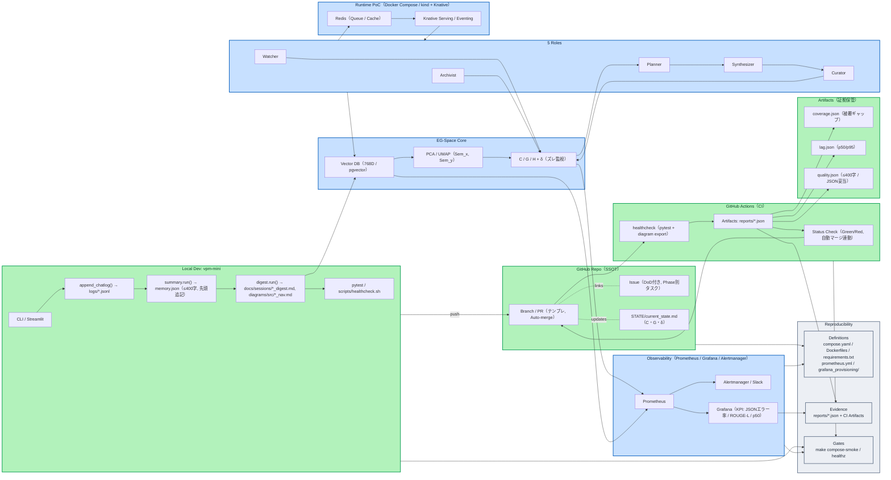

```mermaid
flowchart LR

%% ========== Local Dev / SSOT / CI（上段：既存の主導線） ==========
subgraph L["Local Dev: vpm-mini"]
  CLI["CLI / Streamlit"]
  LOG["append_chatlog() → logs/*.jsonl"]
  SUM["summary.run() → memory.json（≤400字, 先頭追記）"]
  DIG["digest.run() → docs/sessions/*_digest.md, diagrams/src/*_nav.md"]
  TST["pytest / scripts/healthcheck.sh"]
  CLI --> LOG --> SUM --> DIG --> TST
end

subgraph R["GitHub Repo（SSOT）"]
  BR["Branch / PR（テンプレ, Auto-merge）"]
  ISS["Issue（DoD付き, Phase別タスク）"]
  ST["STATE/current_state.md（C・G・δ）"]
  BR -. "links" .- ISS
  BR -. "updates" .- ST
end

subgraph C["GitHub Actions（CI）"]
  HC["healthcheck（pytest + diagram export）"]
  ART["Artifacts: reports/*.json"]
  STAT["Status Check（Green/Red, 自動マージ連動）"]
  HC --> ART --> STAT
end

subgraph P["Artifacts（証拠保管）"]
  COV["coverage.json（被覆ギャップ）"]
  LAG["lag.json（p50/p95）"]
  QLT["quality.json（≤400字 / JSON妥当）"]
end

L -->|push| BR
BR --> HC
STAT --> BR
ART --> COV
ART --> LAG
ART --> QLT

%% ========== EG-Space / Roles / Runtime（中段：機能ブロック） ==========
subgraph EG["EG‑Space Core"]
  VEC["Vector DB（768D / pgvector）"]
  PCA["PCA / UMAP（Sem_x, Sem_y）"]
  CGH["C / G / H + δ（ズレ監視）"]
  VEC --> PCA --> CGH
end

subgraph ROLES["5 Roles"]
  WATCHER["Watcher"]
  CURATOR["Curator"]
  PLANNER["Planner"]
  SYN["Synthesizer"]
  ARCH["Archivist"]
  WATCHER --> CGH
  CURATOR --> CGH
  CGH --> PLANNER --> SYN --> CURATOR
  ARCH --> CGH
end

subgraph RT1["Runtime PoC（Docker Compose / kind + Knative）"]
  REDIS["Redis（Queue / Cache）"]
  KN["Knative Serving / Eventing"]
end

subgraph OBS1["Observability（Prometheus / Grafana / Alertmanager）"]
  PROM["Prometheus"]
  GRAF["Grafana（KPI: JSONエラー率 / ROUGE‑L / p50）"]
  ALERT["Alertmanager / Slack"]
  PROM --> GRAF
  PROM --> ALERT
end

DIG --> VEC
ROLES --> REDIS
ROLES --> VEC
CGH --> PROM
VEC --> PROM
KN --> ROLES
REDIS --> KN

%% ========== Reproducibility Spine（下段：再現性の“帯”） ==========
subgraph REPRO["Reproducibility"]
  DEF["Definitions<br/>compose.yaml / Dockerfiles / requirements.txt<br/>prometheus.yml / grafana_provisioning/"]
  EVI["Evidence<br/>reports/*.json + CI Artifacts"]
  GATE["Gates<br/>make compose-smoke / healthz"]
end

%% 配線（既存主導線 → 再現性）
R --> DEF
OBS1 --> DEF
ART --> EVI
GRAF --> EVI
L --> GATE
C --> GATE
OBS1 --> GATE

%% ========== Coloring（Phase色：例。必要に応じて前図と揃える） ==========
classDef Phase0 fill:#B2F2BB,stroke:#009B4D,stroke-width:2px,color:#0B4725;
classDef Phase1 fill:#C7E0FF,stroke:#005BBB,stroke-width:2px,color:#0B2545;
classDef Phase2 fill:#D8B4FE,stroke:#6B21A8,stroke-width:2px,color:#2D0A47;
classDef Neutral fill:#ECEFF4,stroke:#64748B,stroke-width:2px,color:#1F2937;

class L,R,C,P Phase0;
class EG,ROLES,RT1,OBS1 Phase1;
class REPRO,DEF,EVI,GATE Neutral;
```