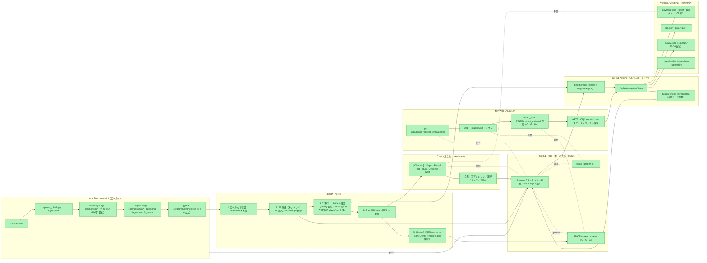
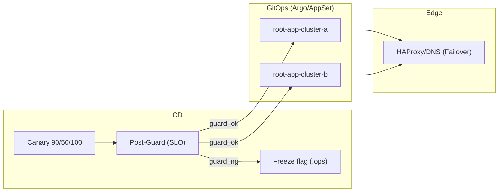

> **Status: CURRENT (Phase 6)**  
> **SSOT: STATE/current_state.md**

# Operations Single Source of Truth v1

この図は Phase 6 における運用ループの唯一の真実（SSOT）を表します。全てのoperational decisionsはこの図とSTATE/current_state.mdに基づいて行われます。

### Phase 6 統合機能: CD Guard / Freeze / Failover / Multi-Cluster

下図は Phase 6 に統合された高度運用機能（Canary→Post-Guard→Freeze／Multi-Cluster GitOps／Edge Failover）を示しています。これらは Phase 5 で開発され、Phase 6 で正式統合されました。

**運用ループ詳細:**
- **Canary**: 90/10 → 50/50 → 100/0（SLOゲートを通過）
- **Post-Guard**: 昇格後に監視ウィンドウで SLO を再評価（NG → Rollback + Freeze + Issue）
- **Multi-Cluster GitOps**: ApplicationSet で a/b 両クラスタを同期（root-app-cluster-*）
- **Edge Failover**: a→b の自動切替（RTO/品質の監査値は reports に保存）

