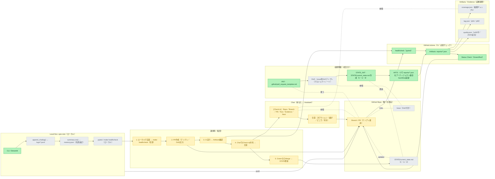

```mermaid
flowchart LR
  %% ==== Environments ====
  subgraph L["Local Dev: vpm-mini（ローカル）"]
    CLI["CLI / Streamlit"]
    LOG["append_chatlog() → logs/*.jsonl"]
    SUM["summary.run() → memory.json（先頭追記）"]
    TST["pytest / make healthcheck（ローカル）"]
    CLI --> LOG --> SUM --> TST
  end

  subgraph R["GitHub Repo（唯一の真実）"]
    BR["Branch / PR（テンプレ適用）"]
    ISS["Issue（DoD付き）"]
    ST["STATE/current_state.md（C・G・δ）"]
    BR -. "links" .- ISS
    BR -. "updates" .- ST
  end

  subgraph C["GitHub Actions（CI／必須チェック）"]
    HC["healthcheck（pytest）"]
    ART["Artifacts: reports/*.json"]
    STAT["Status Check（Green/Red）"]
    HC --> ART --> STAT
  end

  subgraph P["Artifacts／Evidence（証拠保管）"]
    COV["coverage.json（被覆ギャップ0）"]
    LAG["lag.json（p50／p95）"]
    QLT["quality.json（≤400字／JSON妥当）"]
  end

  subgraph CHAT["Chat（あなた ↔ Assistant）"]
    CK["[Check-in]：Repo／Branch／PR／Run／Evidence／Next"]
    DEC["合意：次アクション（誰が／どこで／何を）"]
    CK --> DEC
  end

  %% ==== Main flows ====
  L -->|push| BR
  BR --> HC
  STAT --> BR
  ART --> COV
  ART --> LAG
  ART --> QLT
  CK -. "参照" .- BR
  CK -. "参照" .- COV
  DEC --> BR

  %% ==== Initial Setup (one-time, 運用基盤4つを含む) ====
  subgraph INIT["初期準備（1回だけ）"]
    PRT["PRT · .github/pull_request_template.md"]
    DoD["DoD · Issue用DoDテンプレ（プロジェクトノート）"]
    STATE_INIT["STATE_INIT · STATE/current_state.md 作成（C・G・δ）"]
    ARTS["ARTS · CIで reports/*.json をアーティファクト保存（workflow追加）"]
    PRT --> DoD --> STATE_INIT --> ARTS
  end
  PRT -. "使う" .- BR
  DoD -. "参照" .- ISS
  STATE_INIT -. "更新" .- ST
  ARTS --> ART

  %% ==== Daily Ops (each change) ====
  subgraph OPS["運用時（毎回）"]
    O1["1. ローカルで実装 → make healthcheck（任意）"]
    O2["2. PR作成（テンプレ／DoD記入）"]
    O3["3. CI実行 → Artifacts確認"]
    O4["4. Chatで[Check-in]共有 → 合意"]
    O5["5. GreenならMerge → STATE更新"]
    O1 --> O2 --> O3 --> O4 --> O5
  end
  TST --> O1
  O2 --> BR
  O3 --> HC
  O4 --> CK
  O5 --> ST

  %% ==== Legend (status colors) ====
  classDef done fill:#B2F2BB,stroke:#009B4D,color:#0B4725;
  classDef wip fill:#FFF3BF,stroke:#E6A700,color:#7A5E00;
  classDef todo fill:#E9ECEF,stroke:#ADB5BD,color:#495057;

  %% ==== 現状の進捗反映 ====
  class CLI done
  class LOG,SUM,TST todo

  class BR wip
  class ISS,ST todo

  class HC,ART,STAT done

  class COV,LAG,QLT todo

  class CK wip
  class DEC wip

  class PRT done
  class DoD todo
  class STATE_INIT done
  class ARTS done

  class O1,O2,O3,O4,O5 wip
```