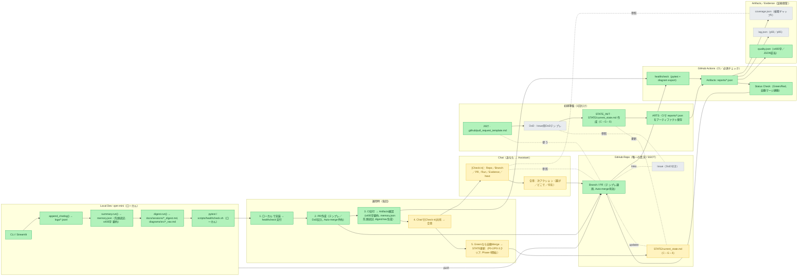

```mermaid
flowchart LR
  %% ==== Environments ====
  subgraph L["Local Dev: vpm-mini（ローカル）"]
    CLI["CLI / Streamlit"]
    LOG["append_chatlog() → logs/*.jsonl"]
    SUM["summary.run() → memory.json（先頭追記, ≤400字 要約）"]
    DIG["digest.run() → docs/sessions/*_digest.md, diagrams/src/*_nav.md"]
    TST["pytest / scripts/healthcheck.sh（ローカル）"]
    CLI --> LOG --> SUM --> DIG --> TST
  end

  subgraph R["GitHub Repo（唯一の真実 / SSOT）"]
    BR["Branch / PR（テンプレ適用, Auto-merge有効）"]
    ISS["Issue（DoD付き）"]
    ST["STATE/current_state.md（C・G・δ）"]
    BR -. "links" .- ISS
    BR -. "updates" .- ST
  end

  subgraph C["GitHub Actions（CI／必須チェック）"]
    HC["healthcheck（pytest + diagram export）"]
    ART["Artifacts: reports/*.json"]
    STAT["Status Check（Green/Red, 自動マージ連動）"]
    HC --> ART --> STAT
  end

  subgraph P["Artifacts／Evidence（証拠保管）"]
    COV["coverage.json（被覆ギャップ0）"]
    LAG["lag.json（p50／p95）"]
    QLT["quality.json（≤400字／JSON妥当）"]
  end

  subgraph CHAT["Chat（あなた ↔ Assistant）"]
    CK["[Check-in]：Repo／Branch／PR／Run／Evidence／Next"]
    DEC["合意：次アクション（誰が／どこで／何を）"]
    CK --> DEC
  end

  %% ==== Main flows ====
  L -->|push| BR
  BR --> HC
  STAT --> BR
  ART --> COV
  ART --> LAG
  ART --> QLT
  CK -. "参照" .- BR
  CK -. "参照" .- COV
  DEC --> BR

  %% ==== Initial Setup (one-time) ====
  subgraph INIT["初期準備（1回だけ）"]
    PRT["PRT · .github/pull_request_template.md"]
    DoD["DoD · Issue用DoDテンプレ"]
    STATE_INIT["STATE_INIT · STATE/current_state.md 作成（C・G・δ）"]
    ARTS["ARTS · CIで reports/*.json をアーティファクト保存"]
    PRT --> DoD --> STATE_INIT --> ARTS
  end
  PRT -. "使う" .- BR
  DoD -. "参照" .- ISS
  STATE_INIT -. "更新" .- ST
  ARTS --> ART

  %% ==== Daily Ops (each change) ====
  subgraph OPS["運用時（毎回）"]
    O1["1. ローカルで実装 → healthcheck 実行"]
    O2["2. PR作成（テンプレ／DoD記入, Auto-merge予約）"]
    O3["3. CI実行 → Artifacts確認（≤400字要約, memory.json先頭追記, digest/nav生成）"]
    O4["4. Chatで[Check-in]共有 → 合意"]
    O5["5. Greenなら自動Merge → STATE更新（P0-2/P0-3クリア, Phase 0開始）"]
    O1 --> O2 --> O3 --> O4 --> O5
  end
  TST --> O1
  O2 --> BR
  O3 --> HC
  O4 --> CK
  O5 --> ST

  %% ==== Legend (status colors) ====
  classDef done fill:#B2F2BB,stroke:#009B4D,color:#0B4725;
  classDef wip fill:#FFF3BF,stroke:#E6A700,color:#7A5E00;
  classDef todo fill:#E9ECEF,stroke:#ADB5BD,color:#495057;

  %% ==== 現状の進捗反映 ====
  class CLI done
  class LOG done
  class SUM done
  class DIG done
  class TST done

  class BR done
  class ISS todo
  class ST wip

  class HC done
  class ART done
  class STAT done

  class COV todo
  class LAG todo
  class QLT done

  class CK wip
  class DEC wip

  class PRT done
  class DoD todo
  class STATE_INIT done
  class ARTS done

  class O1 done
  class O2 done
  class O3 done
  class O4 wip
  class O5 wip
```