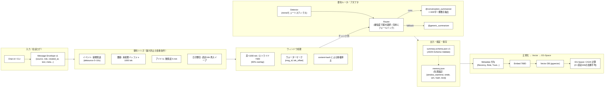

```mermaid
flowchart LR
  %% ========= Entry (Conversation Logs) =========
  subgraph ENTRY["入力（会話ログ）"]
    UI["Chat UI / CLI"]
    ENV["Message Envelope v1\n{source, role, created_at, text, meta...}"]
    UI --> ENV
  end

  %% ========= Trigger Layer =========
  subgraph TRIG["要約トリガ（漏れ防止の多重条件）"]
    EV["イベント: 新規発話\n(debounce 5–10s)"]
    TH["閾値: 未処理バッファ ≥ 1000 tok"]
    IDLE["アイドル: 無発話 5 min"]
    DAILY["日次整合: 直近24h 再スイープ"]
  end
  ENV --> TRIG

  %% ========= Windowing =========
  subgraph WIN["ウィンドウ処理"]
    WCFG["窓=1000 tok / ストライド=500\n(50% overlap)"]
    WM["ウォーターマーク\n(msg_id, tok_offset)"]
    HASH["content-hash による重複抑止"]
  end
  TRIG --> WIN
  WIN -->|チャンク列| ROUTER

  %% ========= Routing & Summarization =========
  subgraph SUM["要約ルータ／アダプタ"]
    DET["Detector\n(mime/ヒューリスティクス)"]
    ROUTER["Router\n(確信度で器を選択 / 汎用にフォールバック)"]
    CONV["@conversation_summarizer\n<=400字 / 重要点抽出"]
    GEN["@generic_summarizer"]
    DET --> ROUTER
    ROUTER -->|conv| CONV
    ROUTER -->|fallback| GEN
  end

  %% ========= Validation & Persist =========
  subgraph OUT["出力・検証・保存"]
    SCHEMA["summary.schema.json v1\n(JSON Schema Validate)"]
    MEM["memory.json\n(先頭追記: {window_start/end, stride, wm, hash, text})"]
    SCHEMA -.-> MEM
  end
  SUM --> OUT

  %% ========= Downstream =========
  subgraph NORM["正規化 → Vector → EG‑Space"]
    META["Metadata 付与\n(Recency, Role, Trust...)"]
    EMBED["Embed 768D"]
    VEC["Vector DB (pgvector)"]
    CGH["EG‑Space: C/G/H 計算\n(C=直近24hの加重平均)"]
    META --> EMBED --> VEC --> CGH
  end
  OUT --> META

  %% ========= Notes =========
  classDef box fill:#fff,stroke:#333,stroke-width:1px,color:#111;
  class UI,ENV,EV,TH,IDLE,DAILY,WCFG,WM,HASH,DET,ROUTER,CONV,GEN,SCHEMA,MEM,META,EMBED,VEC,CGH box;
```