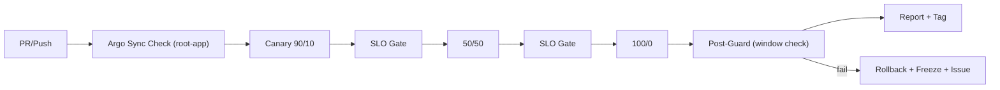

# CD Canary Pipeline（GitHub Actions）

本書は **PR → Argo 同期 → 90/10 → SLO ゲート → 50/50 → SLO ゲート → 100/0 → Post-Guard → Snapshot/Tag** の自動昇格パイプライン仕様をまとめる。

## 1. 対象とトリガ
- **対象**: `infra/gitops/apps/hello/**`, `infra/gitops/apps/hello-v2/**`
- **トリガ**: `push`（パスベース） / `workflow_dispatch`（手動実行）
- **Runner**: **self-hosted**（クラスタ到達が必要）
- **Secret**: `KUBE_CONFIG_DATA`（base64 の kubeconfig）

## 2. フロー概要

## 3. ステージと SLO ゲート
- **リクエスト計測**（既定 N=300, p50<1000ms, success≥99%）
- **scripts/phase4_canary_promote.sh** が 90/10 → 50/50 → 100/0 を実施
- いずれかのゲート NG で **非 0 終了**（昇格中断、HTTPRoute は直前比率を維持）
- **成果物**: `reports/phase4_canary_promotion.json`（Actions artifact でも保存）

## 4. Post-Promotion Guard
- **scripts/cd_guard_post_promotion.py** が **監視ウィンドウ**（既定 10 分） で再評価
- **OK**: スナップショット生成 → タグ付与（例: `phase5-2-cd-canary`）
- **NG**: `scripts/cd_guard_rollback.sh` で Rollback → Freeze（`.ops/deploy_freeze.json`）→ GitHub Issue 起票

## 5. Freeze チェック
- Workflow 冒頭で `.ops/deploy_freeze.json` を検査
- `{"freeze": true}` の場合は **即中止**（手動で Unfreeze PR を作成）

## 6. アーティファクト / スナップショット
- **Artifacts**: `reports/phase4_canary_promotion.json`
- **Snapshot**: `reports/snap_phase5-2-cd-canary.md`（Jinja2 生成 OK）
- **タグ**: `phase5-2-cd-canary`（成功時のみ）

## 7. 失敗時の扱い
- **昇格ゲート NG**: ジョブ失敗 / 直前段階で停止（human follow-up）
- **Post-Guard NG**: 自動 Rollback + Freeze + Issue（再開は Runbook の Unfreeze 手順）

## 8. 前提と最小権限
- kubeconfig は対象 NS（`hyper-swarm`, `istio-system` など）への最小権限
- URL は dev では `http://localhost:31380/hello` を既定（環境に合わせて上書き可能）

## 9. 参考ファイル
- `.github/workflows/cd_canary.yml`
- `scripts/phase4_canary_promote.sh` / `scripts/phase4_canary_gate.py`
- `scripts/cd_guard_post_promotion.py` / `scripts/cd_guard_rollback.sh`
- `docs/runbooks/http_slo_999.md`（Freeze/Guard 初動）
