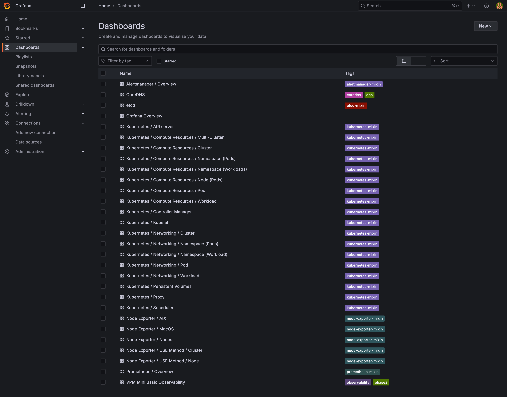

# P2-4 Grafana Panel Evidence @ 20251014_062209

## Dashboard JSON (head)
{
  "__inputs": [
    {
      "name": "DS_PROMETHEUS",
      "label": "Prometheus",
      "type": "datasource",
      "pluginId": "prometheus",
      "pluginName": "Prometheus"
    }
  ],
  "__requires": [
    {
      "type": "panel",
      "id": "stat",
      "name": "Stat",
      "version": ""
    },
    {
      "type": "panel",
      "id": "timeseries",
      "name": "Time series",
      "version": ""
    },
    {
      "type": "datasource",
      "id": "prometheus",
      "name": "Prometheus",
      "version": "1.0.0"
    },
    {
      "type": "grafana",
      "id": "grafana",
      "name": "Grafana",
      "version": "10.4.1"
    }
  ],
  "annotations": {
    "list": [
      {
        "builtIn": 1,

## Screenshot

