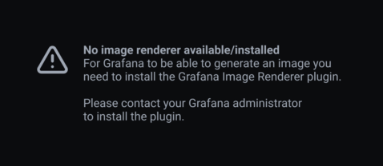

# P3-1 metrics-echo RPS enable @ 20251015_034043
## PodMonitor
apiVersion: monitoring.coreos.com/v1
kind: PodMonitor
metadata:
  name: ksvc-metrics-echo-queue-proxy-9091
  namespace: monitoring
  labels:
    release: kps
spec:
  namespaceSelector:
    matchNames: ["default"]
  selector:
    matchLabels:
      serving.knative.dev/service: "metrics-echo"
  podMetricsEndpoints:
  - port: http-usermetric
    path: /metrics
    interval: 15s
    scrapeTimeout: 10s
    enableHttp2: false

## Prometheus jobs head (API dump or note)
```
$ kubectl -n monitoring exec prometheus-kps-kube-prometheus-stack-prometheus-0 -- \
    wget -qO- 'http://localhost:9090/api/v1/series?match[]=up{job="monitoring/ksvc-metrics-echo-queue-proxy-9091"}'
{"status":"success","data":[{"__name__":"up","container":"queue-proxy","endpoint":"http-usermetric","instance":"10.244.0.155:9091","job":"monitoring/ksvc-metrics-echo-queue-proxy-9091","namespace":"default","pod":"metrics-echo-00007-deployment-89cbcf8f6-csf5r"},{"__name__":"up","container":"queue-proxy","endpoint":"http-usermetric","instance":"10.244.0.158:9091","job":"monitoring/ksvc-metrics-echo-queue-proxy-9091","namespace":"default","pod":"metrics-echo-00007-deployment-89cbcf8f6-r88w5"}]}
```

## Grafana RPS Panel (screenshot)

Captured after driving steady load (120 curls / 60s) with PromQL `sum by (pod) (rate(revision_request_count{job="monitoring/ksvc-metrics-echo-queue-proxy-9091"}[1m]))`.
